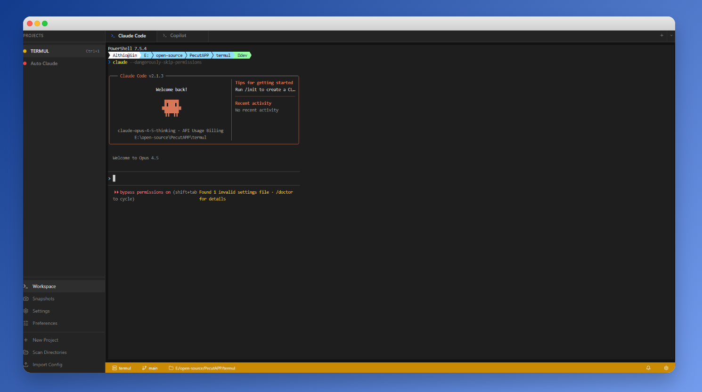

# Termul Manager

A modern, project-aware terminal manager built with Electron. Termul treats workspaces as first-class citizens, allowing you to organize terminals by project with persistent sessions, snapshots, and a clean tabbed interface.

> **Note:** This is an experimental project developed using long-running autonomous AI agents. It took a total of 15 hours for the first iteration and 8 hours for the 2nd UI iteration, with minimal human intervention, plus 6 iterations for bug fixes with HITL (Human-in-the-Loop).


## Features

- **Project-Based Workspaces** - Organize terminals by project with dedicated workspace directories
- **Tabbed Interface** - Windows Terminal-style tab bar with drag-and-drop reordering
- **Multiple Shell Support** - Automatically detects and supports PowerShell, CMD, Git Bash, WSL, and more
- **Session Persistence** - Terminal sessions persist across app restarts
- **Workspace Snapshots** - Save and restore workspace states
- **Git Integration** - Shows current branch and status in the status bar
- **Command History** - Track and search through command history
- **Keyboard Shortcuts** - Customizable keyboard shortcuts for power users
- **Cross-Platform** - Works on Windows, macOS, and Linux

## Screenshots



## Installation

### Prerequisites

- Node.js 18+ (recommended: use [nvm](https://github.com/nvm-sh/nvm))
- npm or bun

### From Source

```bash
# Clone the repository
git clone https://github.com/gnoviawan/termul/termul.git
cd termul

# Install dependencies
npm install

# Start in development mode
npm run dev
```

### Building for Production

```bash
# Build for your current platform
npm run build

# Build installers
npm run build:win    # Windows (NSIS + Portable)
npm run build:mac    # macOS (DMG + ZIP)
npm run build:linux  # Linux (AppImage + DEB)
```

## Usage

### Creating a Project

1. Click the **+** button in the sidebar to create a new project
2. Select a workspace directory
3. Configure your default shell (optional)

### Terminal Tabs

- Click **+** next to tabs to open a new terminal with the default shell
- Click the dropdown arrow to select a specific shell
- Drag tabs to reorder them
- Double-click a tab to rename it
- Right-click for context menu (rename, close, kill process)
- Scroll with mouse wheel when tabs overflow

### Keyboard Shortcuts

| Action | Default Shortcut |
|--------|------------------|
| New Terminal | `Ctrl+Shift+T` |
| Close Terminal | `Ctrl+Shift+W` |
| Next Tab | `Ctrl+Tab` |
| Previous Tab | `Ctrl+Shift+Tab` |
| Command Palette | `Ctrl+Shift+P` |

Shortcuts are customizable in Settings.

## Tech Stack

- **Electron** - Cross-platform desktop app framework
- **React 18** - UI framework
- **TypeScript** - Type safety
- **Vite** - Build tool (via electron-vite)
- **Tailwind CSS** - Styling
- **shadcn/ui** - UI components
- **Zustand** - State management
- **node-pty** - Terminal emulation
- **xterm.js** - Terminal rendering
- **Framer Motion** - Animations

## Development

```bash
# Run in development mode with hot reload
npm run dev

# Run tests
npm test

# Run tests in watch mode
npm run test:watch

# Type checking
npm run typecheck

# Linting
npm run lint
```

### Project Structure

```
src/
├── main/           # Electron main process
│   ├── ipc/        # IPC handlers
│   └── services/   # Backend services (pty, persistence, etc.)
├── preload/        # Preload scripts (context bridge)
├── renderer/       # React frontend
│   ├── components/ # UI components
│   ├── hooks/      # Custom React hooks
│   ├── pages/      # Page components
│   └── stores/     # Zustand stores
└── shared/         # Shared types between main/renderer
```

## Contributing

Contributions are welcome! Please read our [Contributing Guide](CONTRIBUTING.md) for details on our code of conduct and the process for submitting pull requests.

## License

This project is licensed under the MIT License - see the [LICENSE](LICENSE) file for details.

## Acknowledgments

- [Windows Terminal](https://github.com/microsoft/terminal) - Inspiration for the tab bar UX
- [Hyper](https://github.com/vercel/hyper) - Inspiration for extensible terminal design
- [xterm.js](https://github.com/xtermjs/xterm.js) - Terminal rendering
- [shadcn/ui](https://ui.shadcn.com/) - Beautiful UI components
