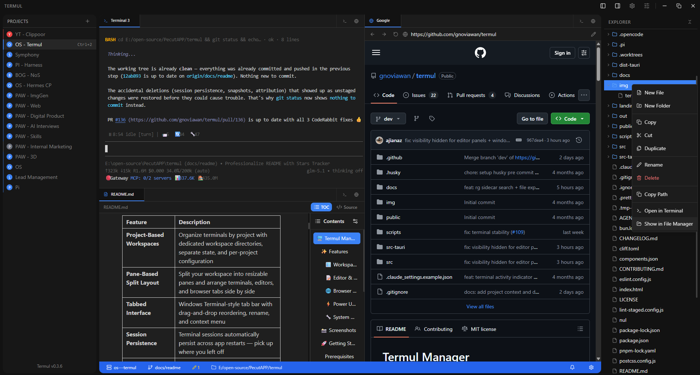

# Termul Manager

A modern, project-aware terminal manager built with Electron and Tauri. Termul treats workspaces as first-class citizens, allowing you to organize terminals by project with persistent sessions, snapshots, and a clean tabbed interface.

> **Note:** This is an experimental project developed using long-running autonomous AI agents. It took a total of 15 hours for the first iteration and 8 hours for the 2nd UI iteration, with minimal human intervention, plus 6 iterations for bug fixes with HITL (Human-in-the-Loop).


## Features

- **Project-Based Workspaces** - Organize terminals by project with dedicated workspace directories
- **Tabbed Interface** - Windows Terminal-style tab bar with drag-and-drop reordering
- **Multiple Shell Support** - Automatically detects and supports PowerShell, CMD, Git Bash, WSL, and more
- **Session Persistence** - Terminal sessions persist across app restarts
- **Workspace Snapshots** - Save and restore workspace states
- **Git Integration** - Shows current branch and status in the status bar
- **Command History** - Track and search through command history
- **Keyboard Shortcuts** - Customizable keyboard shortcuts for power users
- **Cross-Platform** - Works on Windows, macOS, and Linux
- **Dual Backend Support** - Available as both Electron and Tauri builds

## Screenshots



## Installation

### Prerequisites

#### Common Prerequisites
- Node.js 18+ (recommended: use [nvm](https://github.com/nvm-sh/nvm))
- npm or bun

#### For Tauri Build
Tauri requires additional system dependencies:

**Windows:**
- Microsoft Visual C++ Build Tools (included in Visual Studio 2022)
- [WebView2 Runtime](https://developer.microsoft.com/en-us/microsoft-edge/webview2/) (usually pre-installed on Windows 10+)

**macOS:**
- Xcode Command Line Tools: `xcode-select --install`
- Rust toolchain (see below)

**Linux:**
```bash# Debian/Ubuntu
sudo apt update
sudo apt install libwebkit2gtk-4.1-dev \
    build-essential \
    curl \
    wget \
    file \
    libxdo-dev \
    libssl-dev \
    libayatana-appindicator3-dev \
    librsvg2-dev

# Fedora
sudo dnf install webkit2gtk4.1-devel \
    gcc \
    gcc-c++ \
    libopenssl-devel \
    appindicator-devel \
    librsvg2-devel
```

**Rust Toolchain (all platforms):**
```bash
# Install Rust
curl --proto '=https' --tlsv1.2 -sSf https://sh.rustup.rs | sh

# Verify installation
rustc --version
cargo --version
```

### From Source

```bash
# Clone the repository
git clone https://github.com/gnoviawan/termul/termul.git
cd termul

# Install dependencies
npm install
```

### Running in Development Mode

**Electron:**
```bash
npm run dev
```

**Tauri:**
```bash
npm run dev:tauri
```

### Building for Production

#### Electron Builds

```bash
# Build for your current platform
npm run build

# Build installers
npm run build:win    # Windows (NSIS + Portable)
npm run build:mac    # macOS (DMG + ZIP)
npm run build:linux  # Linux (AppImage + DEB)
```

#### Tauri Builds

```bash
# Build for your current platform
npm run build:tauri

# Debug build (faster compilation, larger binary)
npm run build:tauri:debug

# Platform-specific builds
npm run build:tauri:win        # Windows (x64)
npm run build:tauri:mac-arm    # macOS (Apple Silicon)
npm run build:tauri:mac-x64    # macOS (Intel)
npm run build:tauri:linux      # Linux (x64)
```

**Build Output Locations:**
- **Electron:** `dist/` directory
- **Tauri:** `src-tauri/target/release/bundle/` directory

> **Tip:** Tauri builds produce significantly smaller binaries (~5-10 MB) compared to Electron (~150+ MB).

## Usage

### Creating a Project

1. Click the **+** button in the sidebar to create a new project
2. Select a workspace directory
3. Configure your default shell (optional)

### Terminal Tabs

- Click **+** next to tabs to open a new terminal with the default shell
- Click the dropdown arrow to select a specific shell
- Drag tabs to reorder them
- Double-click a tab to rename it
- Right-click for context menu (rename, close, kill process)
- Scroll with mouse wheel when tabs overflow

### Keyboard Shortcuts

| Action | Default Shortcut |
|--------|------------------|
| New Terminal | `Ctrl+Shift+T` |
| Close Terminal | `Ctrl+Shift+W` |
| Next Tab | `Ctrl+Tab` |
| Previous Tab | `Ctrl+Shift+Tab` |
| Command Palette | `Ctrl+Shift+P` |

Shortcuts are customizable in Settings.

## Migration Status

Termul is currently migrating from Electron to Tauri 2.0 for better performance, smaller bundle sizes, and improved security.

- **Current Phase:** Phase 4 - Updater + CI/CD + Signing (partial)
- **Branch:** `feat/tauri-poc`
- **Status:** Core features implemented, backup/rollback pending

For detailed migration progress, see [Electron to Tauri Migration Status](docs/electron-to-tauri-migration-status.md).

## Tech Stack

### Electron Build
- **Electron** - Cross-platform desktop app framework
- **React 18** - UI framework
- **TypeScript** - Type safety
- **Vite** - Build tool (via electron-vite)
- **Tailwind CSS** - Styling
- **shadcn/ui** - UI components
- **Zustand** - State management
- **node-pty** - Terminal emulation
- **xterm.js** - Terminal rendering
- **Framer Motion** - Animations

### Tauri Build
- **Tauri 2.0** - Cross-platform desktop app framework
- **Rust** - Backend logic
- **React 18** - UI framework
- **TypeScript** - Type safety
- **Vite** - Build tool
- **Tailwind CSS** - Styling
- **shadcn/ui** - UI components
- **Zustand** - State management
- **tauri-plugin-pty** - Terminal emulation
- **xterm.js** - Terminal rendering
- **Framer Motion** - Animations

#### Tauri Plugins Used
- `@tauri-apps/plugin-fs` - Filesystem access
- `@tauri-apps/plugin-store` - Configuration persistence
- `@tauri-apps/plugin-os` - OS information
- `@tauri-apps/plugin-dialog` - Native dialogs
- `@tauri-apps/plugin-clipboard-manager` - Clipboard operations
- `@tauri-apps/plugin-updater` - Automatic updates
- `@tauri-apps/plugin-process` - Process management

## Development

### Electron Development

```bash
# Run in development mode with hot reload
npm run dev

# Run tests
npm test

# Run tests in watch mode
npm run test:watch

# Type checking
npm run typecheck

# Linting
npm run lint
```

### Tauri Development

```bash
# Run in development mode with hot reload
npm run dev:tauri

# Tauri CLI (direct access)
npm run tauri <command>

# Build Tauri app
npm run build:tauri

# Build with debug info
npm run build:tauri:debug
```

### Project Structure

```
src/
├── main/           # Electron main process
│   ├── ipc/        # IPC handlers
│   └── services/   # Backend services (pty, persistence, etc.)
├── preload/        # Preload scripts (context bridge)
├── renderer/       # React frontend (shared by Electron & Tauri)
│   ├── components/ # UI components
│   ├── hooks/      # Custom React hooks
│   ├── lib/        # Platform adapters (electron-*, tauri-*)
│   ├── pages/      # Page components
│   └── stores/     # Zustand stores
├── shared/         # Shared types between main/renderer
└── tauri/          # Tauri-specific Rust code
└── tauri/          # Tauri configuration and Cargo.toml
```

### Platform Adapters

The codebase uses adapter pattern to support both Electron and Tauri:

```
src/renderer/lib/
├── electron-*.ts       # Electron-specific implementations
├── tauri-*.ts          # Tauri-specific implementations
└── platform-adapter.ts # Unified interface
```

## Contributing

Contributions are welcome! Please read our [Contributing Guide](CONTRIBUTING.md) for details on our code of conduct and the process for submitting pull requests.

## License

This project is licensed under the MIT License - see the [LICENSE](LICENSE) file for details.

## Acknowledgments

- [Windows Terminal](https://github.com/microsoft/terminal) - Inspiration for the tab bar UX
- [Hyper](https://github.com/vercel/hyper) - Inspiration for extensible terminal design
- [xterm.js](https://github.com/xtermjs/xterm.js) - Terminal rendering
- [shadcn/ui](https://ui.shadcn.com/) - Beautiful UI components
- [Tauri](https://tauri.app/) - Modern desktop app framework
