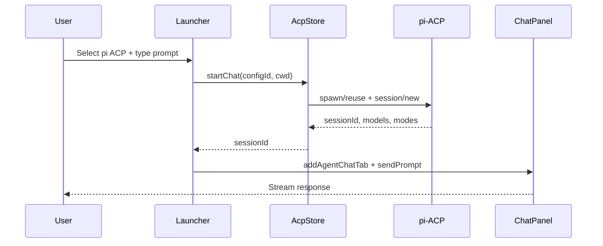
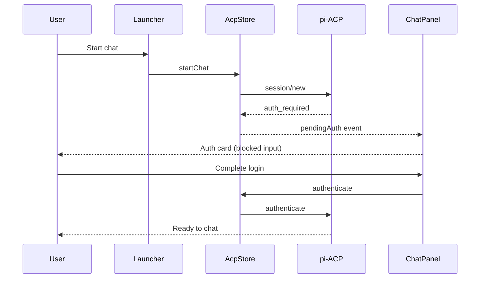

# UX Recommendation Spec: Agent Chat (ACP) in Termul

**Status:** Draft recommendation  
**Date:** 2026-06-10  
**Scope:** Agent Chat experience, with emphasis on ACP agents (pi-ACP, Claude ACP, registry agents, etc.)  
**Audience:** Product, design, and implementation  

---

## Executive summary

Termul already has a strong technical foundation for Agent Chat: pane-first layout, background prewarm, per-project process isolation, unified CLI/ACP launcher, model/thinking controls, and local history. The largest UX gaps are **guided setup** (especially auth for pi-ACP), **lifecycle feedback** (warming, blocked, ready), and **unifying launcher ↔ history ↔ session** so the product feels like one coherent chat experience—not an orchestration layer on top of subprocesses.

**North star (one sentence):**

> Pick a project → type a question → the agent answers in the context of this repo—with history, model, and reasoning under your control, without needing to understand ACP.

---

## Current behavior (baseline)

| Stage | What happens today |
|---|---|
| **Enable** | Settings → ACP Agents → toggle registry agent |
| **Prewarm** | On app mount, enabled agents spawn + `initialize` for the active project's cwd |
| **Launch** | Launcher (empty pane / Ctrl+T overlay) → select agent + CLI/ACP mode → `startChat` |
| **Session** | One workspace tab = one `sessionId`; agent process reused per **config + cwd** |
| **Chat** | Streamed messages, tool calls, permission dialog, model/thinking chips in input bar |
| **History** | Separate `ChatHistoryTab` → `openHistorySession` with load/resume/local strategies |

### Key architecture constraints (inform UX, do not fight)

- **One OS process per agent config + cwd** — same agent in two projects = two processes (by design).
- **ACP is real, not cosmetic** — model picker → `session/set_model`; thinking chip → `session/set_mode` → pi `set_thinking_level`.
- **Dual surfaces** — some agents support CLI (terminal TUI) and ACP (structured chat UI).
- **Registry-driven** — agents come from bundled `agents.json` + user-enabled configs in Settings.

### Related code entry points

| Area | Primary files |
|---|---|
| Launcher | `src/renderer/components/agents/AgentLauncher.tsx` |
| Chat pane | `src/renderer/components/chat/AgentChatPanel.tsx` |
| ACP store / lifecycle | `src/renderer/stores/acp-store.ts` |
| Prewarm on mount | `src/renderer/hooks/use-acp-agents.ts` |
| Settings enable | `src/renderer/components/settings/AcpAgentsSettings.tsx` |
| History | `src/renderer/components/chat/ChatHistoryTab.tsx` |
| Workspace integration | `src/renderer/components/workspace/PaneContent.tsx`, `WorkspaceLayout.tsx` |
| Model/thinking UX | `src/renderer/lib/acp-thinking.ts`, `ChatInputBar.tsx`, `AgentHeader.tsx` |

---

## UX principles

1. **One primary action per screen** — users should not need to understand spawn vs session vs process.
2. **Feedback before failure** — auth, cold start, and binary install should be proactive, not error-toast reactive.
3. **Project context always visible** — cwd/worktree = "where the agent is working."
4. **Progressive disclosure** — model, thinking, MCP, slash commands are power-user controls, not first-run noise.
5. **Don't break coding flow** — permissions and auth should be resolvable without losing thread context.

---

## 1. Onboarding & first run

### Problems today

- User enables pi-ACP in Settings, opens launcher, hits auth errors or long delays without clear explanation.
- Dual-mode agents (CLI + ACP) require a decision before the user understands the difference.
- Prerequisites (`pi` on PATH, Node, API keys) are implicit.

### Recommendations

#### A. Inline setup checklist (first use per agent)

When an agent is enabled but not ready (auth missing, binary not installed, `pi` not on PATH):

```
pi ACP — Setup (2/3)
☑ Enabled in settings
☐ API key / login configured     [Open setup guide]
☐ Ready to chat                    [Test connection]
```

- Show in launcher empty state or as a banner—not a blocking modal.
- Persist checklist progress per agent + project.

#### B. Smart default for dual-mode agents

For agents with both CLI and ACP (e.g. Claude, Gemini):

- **Default to ACP** when enabled in Settings.
- CLI available as "Terminal mode" with clear copy:
  - **Chat** — structured UI, permissions, history, model picker
  - **Terminal** — full native TUI, all CLI shortcuts

#### C. One-click "Verify" in Settings

Expose existing `testAgent` flow as **Verify** on each agent row:

- Spawn briefly, show ✓/✗ with human-readable reason (auth required, npx failed, binary missing, etc.).
- Reduces "it doesn't work" support burden.

#### D. pi-ACP-specific setup guide

Document in-product (not external README only):

- API key env vars per provider
- `pi --version` prerequisite
- Terminal login flow (`--terminal-login` or equivalent) when ACP returns `auth_required`
- Link to pi model list / credential setup

---

## 2. Launcher (primary entry point)

### Problems today

- Launcher is visually clean but still a generic prompt box.
- `prepareChat` runs in background when ACP mode is selected—user doesn't know the session is warming.
- History is disconnected from launch flow.

### Recommendations

#### A. Three explicit launcher states

| State | UI treatment |
|---|---|
| **Ready** | Input + primary CTA enabled |
| **Warming** | "Starting pi ACP…" + subtle spinner on agent chip |
| **Blocked** | Auth/setup CTA; input disabled with reason text |

Map to store signals: `agentStatus`, `preparingChatKeys`, `pendingAuth`, `warmingConfigs`.

#### B. Contextual placeholder & cwd hint

Replace generic placeholder with agent-aware copy:

- pi-ACP: `Ask about this repo… (/ for commands)`
- Show **short cwd** under agent selector: `~/Projects/foo · main` or worktree name

#### C. Primary CTA label: "New chat"

Button label **New chat** or **Start**—not "Launch agent." Users start a conversation, not a process.

#### D. Slash/skills discoverability

Keep `/` slash menu; add first-run hint or small **Skills** affordance: `Type / to browse skills`.

#### E. Quick resume in launcher

Below input, a compact recent row:

```
Recent: "Fix git tracker" · 2h ago    [Continue]
```

Bridges launcher ↔ history without opening a separate History tab.

#### F. Background prepare on ACP selection

Continue `prepareChat` when user selects ACP mode; surface state in UI (see Warming state above).

---

## 3. In-chat experience (AgentChatPanel)

### Problems today

- Model + Thinking + Agent chips in input bar—dense; relationships between chips unclear.
- Auth banner is thin; pi needs terminal login but UX doesn't guide it.
- `session.lastError` is a single red line—easy to miss.
- Thinking blocks vs thinking mode can confuse users (addressed technically; UX copy still helps).

### Recommendations

#### A. Chip hierarchy (left → right = broad → specific)

```
[Agent ▾] [Model ▾] [Thinking ▾]     ……     [Send]
```

- **Agent** — rarely changed; consider moving to header only.
- **Model** — what answers.
- **Thinking** — how deep reasoning runs; hidden when non-reasoning model (implemented).

#### B. Informative session header

Extend `AgentHeader`:

| Element | Purpose |
|---|---|
| Status | `Connected` / `Thinking…` / `Running tool` / `Needs auth` |
| Working directory | Click → reveal full path / open in file explorer |
| **New chat** | New session, same agent config |
| **Close** | Close tab / end session |

#### C. Auth as a card, not a thin strip

```
┌─────────────────────────────────────────┐
│ pi needs authentication                 │
│ Configure API key or run login in terminal│
│ [Open terminal login]  [I've configured] │
└─────────────────────────────────────────┘
```

For pi-ACP: integrate or deep-link terminal login; don't rely on cryptic `auth_required` alone.

#### D. Actionable errors & empty states

| Condition | UX |
|---|---|
| Turn failed | Inline in thread + **Retry** / **Edit message** |
| Agent disconnected | Sticky banner + **Reconnect** |
| Session closed | Replace input with **Resume chat** / **Start new** |

#### E. Thinking visibility policy

| Mode | Behavior |
|---|---|
| `off` | No thinking block in timeline (filter at ingest + render) |
| `minimal`–`xhigh` | Collapsible block, **collapsed by default** |
| User preference (optional) | "Always expand reasoning" in settings |

Clarify in UI copy: **Thinking controls real model reasoning**, not just display.

---

## 4. Permissions & tools

### Problems today

`PermissionDialog` is modal—correct for safety, but interrupts flow.

### Recommendations

#### A. Inline permissions in timeline

Tool call card with **Allow** / **Deny** / **Always allow this session**—similar to Cursor/Copilot patterns.

#### B. Batch permissions

"Allow all read tools this turn" when agent requests many file reads.

#### C. Rich tool call cards

Already in timeline; enhance with:

- Status: running / completed / failed
- Collapsed by default for verbose output
- **Open file** when path is local and safe

---

## 5. Multi-tab, multi-pane, multi-project

### Strengths today

- One agent config + cwd = one process (isolation).
- Project B unaffected when project A's agent disconnects.

### Recommendations

#### A. Meaningful tab titles

Not generic "Agent Chat":

- Session title (from agent or first user message)
- Subtitle: `pi · grok-build-0.1` or model id short form

#### B. "Same agent, new chat" vs continue

Ctrl+T on pane with existing chat → launcher overlay → **new session** by default; explicit **Continue** for recent session.

#### C. Background process indicator

Subtle dot or status bar hint: agent alive / warming / needs auth—without exposing "spawn" terminology.

#### D. Worktree-aware badge

When cwd is a worktree, show `worktree: feature-x` in chat header so users trust branch context.

---

## 6. History & continuity

### Problems today

History lives in a separate tab—feels disconnected from launcher and active tabs.

### Recommendations

#### A. Unified "Chats" entry point

Project sidebar or command palette:

- New chat
- Recent chats (Today / Yesterday / …)

#### B. Intent-based resume (hide protocol)

When opening history, offer user intent—not ACP method names:

| User choice | Backend strategy (internal) |
|---|---|
| **Continue conversation** | `resume` when supported |
| **View transcript** | local payload only |
| **Sync from agent** | `load` when supported |

#### C. Auto-title sessions

Generate title from first user message for scanability in history list.

#### D. Delete / archive

Clear affordance to remove history entries; confirm if live session still attached.

---

## 7. Settings & power features

Keep advanced options out of first-run; expose for power users.

| Feature | Recommended placement |
|---|---|
| MCP servers | Settings → ACP → Connections; launcher chip: `MCP: 2 active` |
| Default model / thinking | Per-agent defaults in Settings |
| Env vars | Show "Inherited from project" vs agent-specific |
| `allowTerminal` | Opt-in with security warning |
| Forked agents (e.g. `pi-acp-termul`) | Version note in agent row |

Do **not** put full MCP configuration in first-run launcher—indicator + link to Settings is enough.

---

## 8. Performance & perceived speed

Existing **prewarm** + **prepareChat** should be visible in UX:

| Technique | UX signal |
|---|---|
| Prewarm on Settings enable | Toast: "pi ACP ready" |
| `prepareChat` on ACP select | Launcher "Warming" state |
| First token latency | Typing indicator (existing `showTyping`) |
| First npx download | Honest copy: "First launch may take 10–20s" |

---

## 9. Copy & terminology guide

| Avoid | Prefer |
|---|---|
| Spawn agent | Start chat / New chat |
| Session ID | (hide from users) |
| ACP / RPC | (hide unless Settings → Advanced) |
| Mode (generic) | Thinking: off / low / high |
| Launch | Send / Start |

---

## 10. Implementation priority

| Priority | Item | Impact | Effort (rough) |
|---|---|---|---|
| **P0** | Auth/setup card for pi-ACP + Verify in Settings | First-run success | Medium |
| **P0** | Launcher states (warming / blocked / ready) | Clarity | Small–Medium |
| **P0** | Recent chats in launcher | Continuity | Medium |
| **P1** | Header: cwd + status + New chat | Context | Small |
| **P1** | Inline permissions | Flow preservation | Large |
| **P1** | Meaningful tab titles | Navigation | Small |
| **P2** | Intent-based history resume UI | Less protocol confusion | Medium |
| **P2** | MCP active indicator | Power users | Small |
| **P2** | Worktree badge in header | Trust / context | Small |
| **P3** | CLI vs Chat copy polish | Onboarding | Small |
| **P3** | Thinking expand preference | Power users | Small |

---

## 11. Success metrics (suggested)

| Metric | Target |
|---|---|
| Time to first successful ACP message (new user, pi-ACP) | < 2 min with guided setup |
| Auth-related abandon rate on first launch | Decrease vs baseline |
| % sessions using history resume | Increase (launcher recent + unified chats) |
| Permission dialog dismiss without action | Decrease (inline permissions) |
| User-reported "agent not working" | Decrease (Verify + checklist) |

---

## 12. Out of scope (for this spec)

- Replacing ACP with custom protocol
- Bundling pi/pi-acp into Tauri binary (separate deployment spec)
- MCP server authoring UI
- Cloud sync of chat history
- Multi-user / team features

---

## 13. Open questions

1. **Terminal login for pi-ACP** — embed in Termul terminal tab vs external terminal vs OAuth web flow?
2. **Default thinking level** — `off` vs `medium` for new pi sessions?
3. **History tab** — merge into sidebar or keep as workspace tab type?
4. **CLI default** — should any built-in agent default to CLI for familiarity (e.g. `claude` CLI users)?

---

## Appendix A: pi-ACP UX quirks (product awareness)

| Behavior | UX implication |
|---|---|
| Sends `AgentThoughtChunk` even when thinking is `off` | Termul filters display; user should not see blocks when off |
| `session/new` returns `models` + `modes` (unstable API) | Model/thinking chips are valid |
| Auth via env / terminal login | Setup checklist + auth card required |
| Reasoning models vs non-reasoning | Hide thinking chip when only `off` supported |
| `xhigh` not universal | Filter levels per model (implemented in `acp-thinking.ts`) |

---

## Appendix B: Reference flows (mermaid)

### Happy path: new ACP chat



### Blocked path: auth required



---

## Revision history

| Date | Author | Notes |
|---|---|---|
| 2026-06-10 | AI-assisted draft | Initial spec from UX review of Termul ACP Agent Chat |
